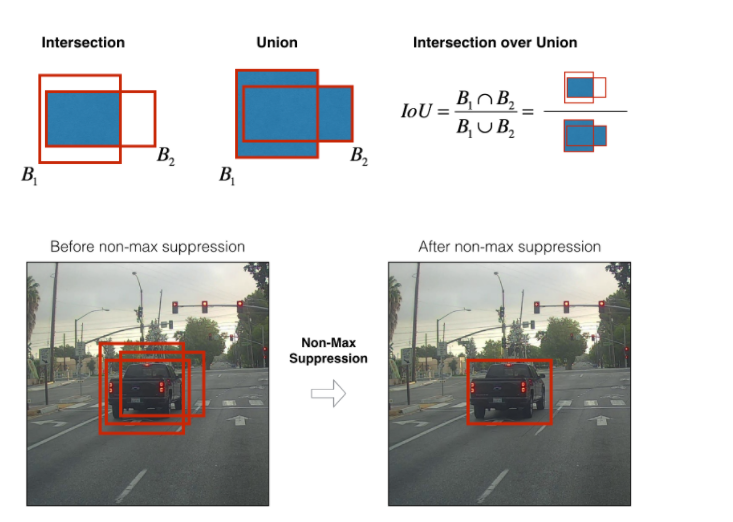
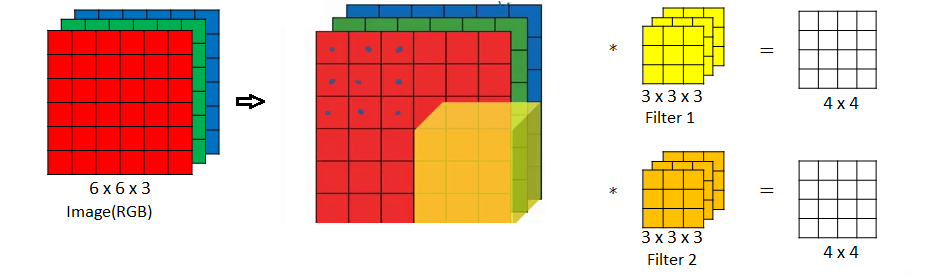
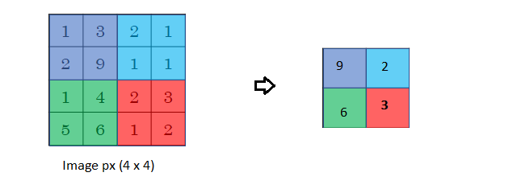
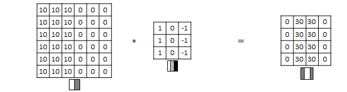
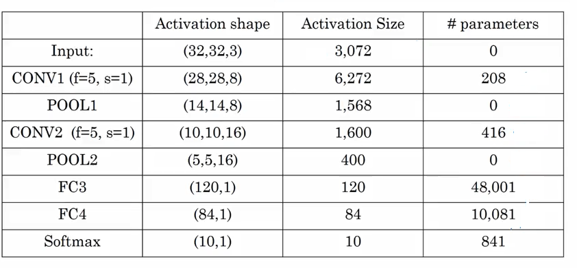

# Custom Object Detection with Yolo Algorithm
You Only Look Once: Unified, Real-Time Object Detection

YOLO papers: Redmon et al., 2016 (https://arxiv.org/abs/1506.02640) and Redmon and Farhadi, 2016 (https://arxiv.org/abs/1612.08242).

YOLO(You only look once) is a popolar algorithm, as it achieves high accuracy and also run in real-time. It require only one forwared propogation pass through the network to make predictions. It outputs recongnized object with Bounding Boxes and percentage accuracy in real-time. It can also determine any number of Objects/Classes at the same time.

Downside of Yolo: Resource Expensive(Recommended to train only on GPU).

 **Input**: 
- 1) Set of Images for Training,a Single Image may have multiple objects to detect(.png)
- 2) Set of Annotation defined with Bounding Boxes(.xml)

**Output**
List of Bounding Boxes along with recongnized Object. Each bounding box is represented by: 6 numbers $(p_c, x_min, y_min, x_max,y_max, c)$
- $p_c$ : Confidence over the Object
- $xmin$ : x-min point of Bounding Box.
- $ymin$ : y-min point of Bounding Box.
- $xmax$ : x-max point of Bounding Box.
- $ymax$ : y-max point of Bounding Box.
- c      : Class of Detected object(A vector of number of Classes).

OR y can be defined as:

- $p_c$ : Confidence over the Object
- $b_x$ : x point, center of Bounding Box.
- $b_y$ : y point, center of Bounding Box.
- $b_h$ : Height of Bounding Box.
- $b_w$ : Width  Bounding Box.
- c      : Class of Detected object(A vector of number of Classes).

<caption>
 <u> **Figure 1** </u>: **Definition of a box**  
</caption>

# Working

It apply a single neural network to the full image. This network divides the image into regions and predicts bounding boxes and probabilities for each region. These bounding boxes are weighted by the predicted probabilities. It consist of Convolution Layers and Pooling Layer.

<caption>
 

## Non-max Suppression Algo
- Problem: The output produces by Convolution layers results in multiple boxes over a Single object.
- Each output box has a predicted class and probabily value.
- It Discard all boxes with probility less than p_c(Ex < 0.6)
- It Discard According to its IOU value.
<u>
<caption>
 <u>

## Convolution Layer:
Convolutional layers apply a convolution operation to the input, passing the result to the next layer. The convolution emulates the response of an individual neuron to visual stimuli.

**Parameter Sharing:** A single feature detector( ie. filter) is used by Complete Image and each RGB channel, by multiplying the filters values with Image.

**Sparsity of Connections:** Each output layer depends only on small number of inputs. As first element of output (ie. output[0][0]) layer depends only on few elememts of input.

<caption>

The number Weights in a NN layer that will learn, is defined by number of filter in previous layer and does not depends on size of input Image.
Example : if a layer has 7 filters, then the Input of next NN layer will have dimension of (height, Width, 7 )

## Pooling Layer (Max Pooling)
Max pooling uses the maximum value from each of a cluster of neurons at the prior layer. 
Hyperparameters: f,s
- f: filter size
- s: Stride

It does not have any Parameter to learn as in Convolution layer.
It is computed for each channel.

<caption>

### Hyperparmeters

**Padding:** It increases the size of Image by adding some pixel around the border of image. It is required, as while filtering the image it may loose the information around the borders.

**Filter:** Each filter detects feauture in a Image. (such as Vertical line/ Lines at different Angles) in terms of pixels in a Image.
Example for Vertical Edge Detection:

<caption>

**Size:** Batch Size for Training
**Strides:** 

# Implementation

## Preparing Data Set

- Download images for the DataSet and save images in "/Data/Images"
- To create Annotations file Use Application to Draw Bounding Box, over the image to selecting over the object and save according its class.("/Data/Annotations"
App : https://github.com/tzutalin/labelImg

Example for Input Array: (m , Height, Weight, channels = 3)
- m : Number of Training Example/Images
- Height: Height of each image
- Width:  Width of each image
- channels: Each image has RGB layer vector

# Configuring the model

It require pre-trained weight to initialize model training, which can be donloaded from "https://pjreddie.com/media/files/tiny-yolo-voc.weights"

and Save the .weights file under in the **"/bin"** directory.

Under the directory **"/cfg/"** subdirectory.
- /yolo.cfg  :is based on the extraction network. It process images at 45 fps.
- /yolo-small.cfg/ :has smaller fully connected layers and It uses very less memory. It process images at 50fps.
- /yolo-tiny.cfg :is much smaller and process images at 155 fps.

For training and defining model, it require only single .cfg file, which defines the number and Sequence of Layer with their Hyperparameters. 

Example of a Complete model

<caption>

# Mandatory field to change 
#### In **cfg/tiny-yolo-volc-1c.cfg**

1) Change classes in the [region] layer (the last layer) to the number of classes, you want to train. (To find only one object, like just car set classes=1).

[region]
classes=1

2) The number of filers in the [colvolution] layer (the second last layer) to num * (classes + 5) = 5*(1+5) => 30

[convolutional]
filters=30

#### In **labels.txt**

Define the number of classes/Objects with their Actual names.
- car

## Command to train the model

> python flow --model cfg/tiny-yolo-voc-1c.cfg  --load bin/tiny-yolo-voc.weights  --train  --annotation data/annotations --dataset data/images  --gpu 0.9  --epoch 300

> python flow  --model [.cfg directory]  --load [.weights]  --train  --annotations [.xml]  --dataset [.png]  --gpu [0.1 to 1.0]  --epoch [training iterations]

- First try without using **--gpu** flag, as tensorflow gpu version might not be properly installed on your system.
- This will start the model training and while training after particular iteration, it will save a **".weights"** files in **/bin** directory. For predict method use the last generated file.

### Resume training with last Checkpoint (Pre-trained model)
flow --train --model cfg/yolo-new.cfg --load -1

## Predicting with Camera or Video file

### For CPU
> python flow --model cfg/tiny-yolo-voc-1c.cfg --load bin/yolo-new.weights --demo videofile.avi

> python flow --model cfg/tiny-yolo-voc-1c.cfg --load 300 --demo videofile.avi

- --load flag iteration last ckeckpoint save in /ckpt/

### For GPU
> python flow --model cfg/tiny-yolo-voc-1c.cfg --load bin/yolo-new.weights --demo videofile.avi --gpu 0.8

- To use webcam for live predicted bounding box, **replace("videofile.avi","camera")** 
- To save as video with predicted bounding box, add **--saveVideo** option.

### For using model in python script

from darkflow.net.build import TFNet
import cv2
options = {"model": "cfg/yolo.cfg", "load": "bin/yolo.weights", "threshold": 0.1}
tfnet = TFNet(options)

imgcv = cv2.imread("./sample_img/sample_dog.jpg")
result = tfnet.return_predict(imgcv)
print(result)

#This will return a json representing each detected object probability with bounding box dimensions.